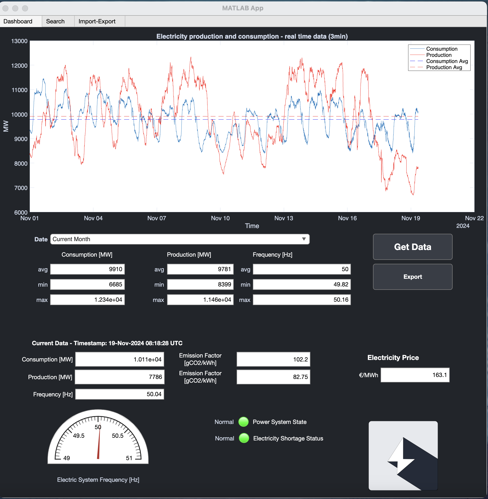
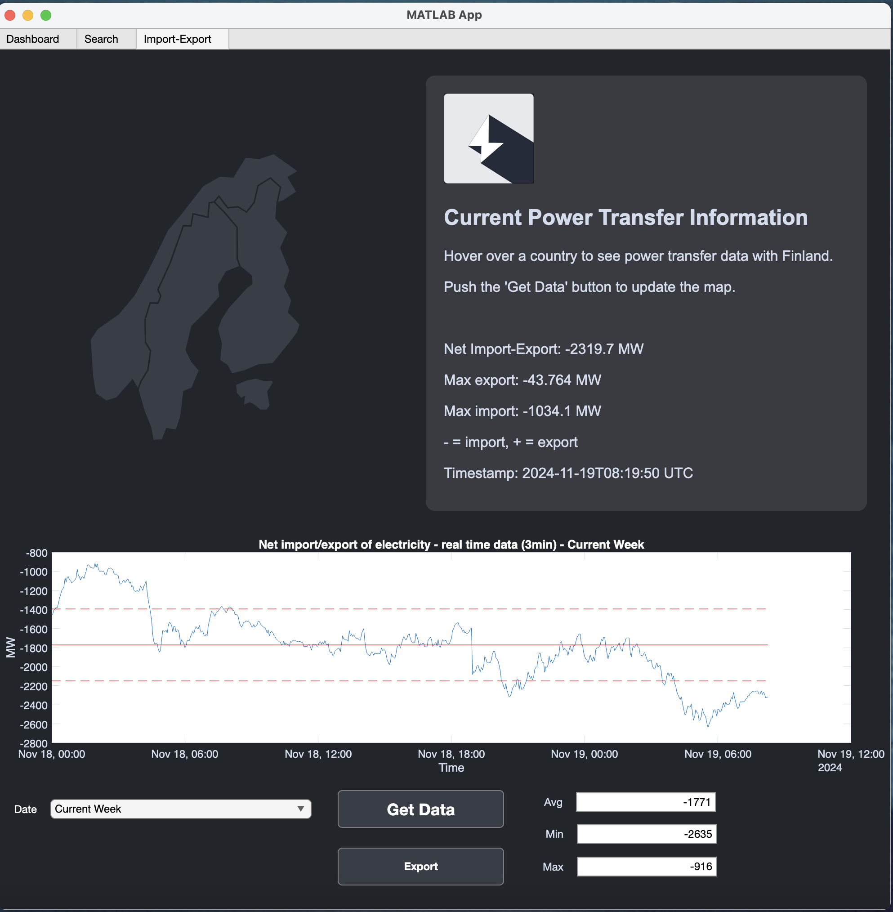

# Fingrid API App

This Matlab app can be used to fetch data from Fingrid API and visualize it. Fingrid is a Finnish national electricity transmission grid operator.

## Usage

Fingrid API key is required to use this app. You can get your own API key from [Fingrid API](https://data.fingrid.fi/en/instructions). Also, Entso-e Token is needed to fetch price data from Entso-e API. You can get your own token from [Entso-e API](https://transparency.entsoe.eu/content/static_content/Static%20content/web%20api/Guide.html).

Simple use case of the app is presented [here](https://youtu.be/KivPSaXIDCk).

## License

MIT License.
